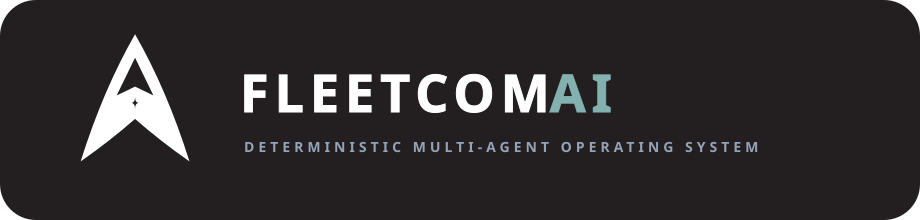
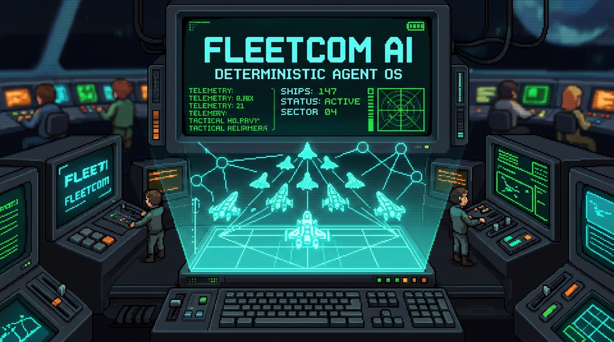
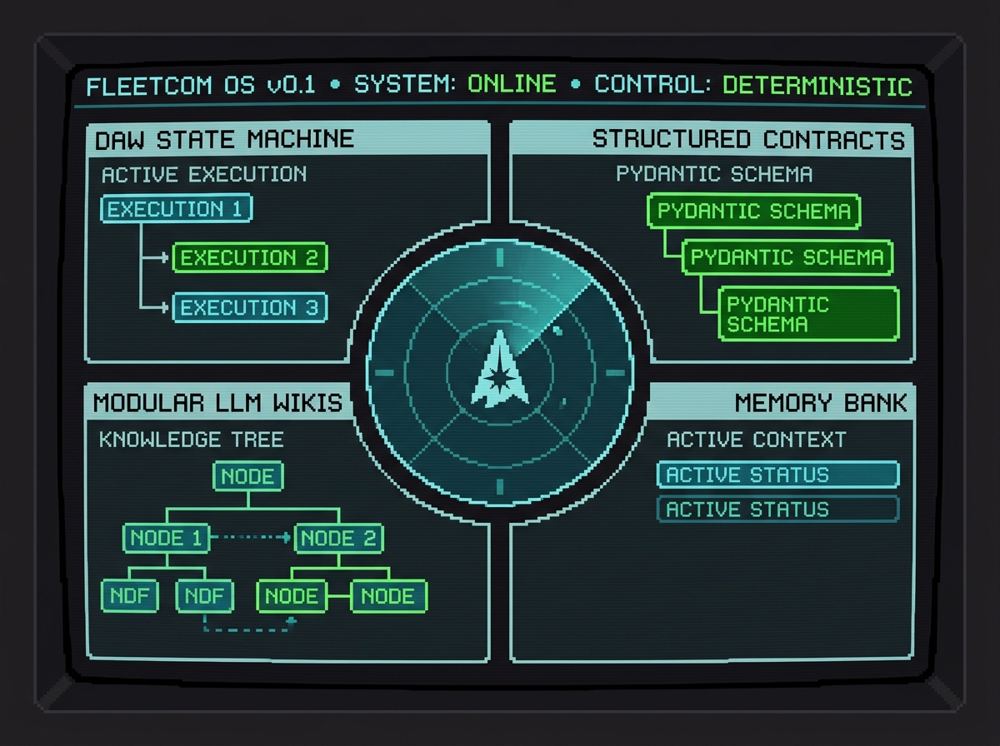

# 🛸 FleetCom AI — The Sovereign Agent OS & Deterministic Workflow Framework

<div align="center">



<br/><br/>

[](https://github.com/nasimulnadim/fleetcom-ai)
[](https://opensource.org/licenses/Apache-2.0)
[](https://www.python.org/downloads/)
[](#-1-deterministic-agentic-workflows-daw)
[](#-4-local-filesystem-first-agent-os)
[](#)

**A Model-Agnostic, Harness-Agnostic Framework and Operating System for Building 100% Reliable, Scalable AI Agents & Systems.**

[**Philosophy**](#-the-fleetcom-philosophy) • [**Five Core Pillars**](#-the-five-core-pillars) • [**Interactive Onboarding**](#-interactive-ai-guided-onboarding-fleetcom-init) • [**Future Horizon: DAW 2.0**](#-future-horizon-the-daw-20-cognitive-architecture-active-research) • [**Roadmap**](#-public-release-roadmap)

---

### 🚧 **PRE-RELEASE TEASER — COMING SOON** 🚧

**We are preparing the open-source release (v0.1) alongside an upcoming deep-dive YouTube launch video!**

⭐ **Star this repository** to get notified the second the codebase, interactive AI setup wizard, and starter templates drop.

</div>

<p align="center">
  
</p>

---

## 🧭 The FleetCom Philosophy

Most agentic AI architectures today are built on a fragile premise: **forcing probabilistic generative Large Language Models to act as real-time system orchestrators**. 

When an autoregressive LLM is placed in an unconstrained loop—deciding what step to take, which tool to invoke, how to format parameters, and when to terminate—it suffers from compound probabilistic decay:

$$\mathcal{P}_{\text{system}} = \prod_{i=1}^{k} \mathcal{P}_{\text{step}_i}$$

If an LLM has an optimistic 85% single-step accuracy ($p = 0.85$), a 5-step unguided loop degrades to **under 44.3% reliability**:

```
UNCONSTRAINED PROBABILISTIC LOOP          FLEETCOM DETERMINISTIC AGENTIC WORKFLOW
════════════════════════════════          ═══════════════════════════════════════
       [ User Objective ]                        [ User Objective ]
               │                                          │
               ▼                                          ▼
       ┌───────────────┐                  ┌───────────────────────────────┐
  ┌──► │   LLM Agent   │ ──┐              │      Compiled Software Code   │
  │    │ (Freeform ReAct)  │  │ Context    │     (Python / LangGraph /     │
  └─── └───────────────┘ ◄─┘  Rot & Drift │          n8n StateGraph)      │
               │                          └──────┬────────┬────────┬──────┘
               ▼                                 │        │        │
          44% Success                     ┌──────┘        │        └──────┐
                                          ▼               ▼               ▼
                                     [Spot-Call]     [Spot-Call]     [Spot-Call]
                                     (Atomic Task)   (Atomic Task)   (Atomic Task)
                                          │               │               │
                                          └───────────────┼───────────────┘
                                                          ▼
                                                 100% Deterministic
                                                       Success
```

**FleetCom AI fundamentally rejects the unconstrained probabilistic loop.**

Inspired by tactical aerospace command matrices and mission-critical industrial control systems, FleetCom AI provides both the **design philosophy** and the **reference implementation** to build autonomous multi-agent fleets with deterministic precision, structured communication protocols, and transparent human oversight.

---

## 🏛️ The Five Core Pillars

FleetCom AI rests on five foundational axioms that govern how agents reason, interact with knowledge, persist state, and execute work.

```
┌─────────────────────────────────────────────────────────────────────────────┐
│                       THE FIVE PILLARS OF FLEETCOM AI                       │
├─────────────────────────────────────┬───────────────────────────────────────┤
│ 1. Deterministic Agentic Workflows  │ Execution routing belongs in code.    │
│ 2. Structured Input & Output        │ Dual typed contracts at every node.   │
│ 3. Modular LLM Wikis                │ Knowledge is structured & composable. │
│ 4. Filesystem-First Agent OS        │ Files are the API (.agents/ + rules). │
│ 5. Virtuous Bootstrap Lifecycle     │ Frontier AI BUILDS, systems RUN.      │
└─────────────────────────────────────┴───────────────────────────────────────┘
```

<p align="center">
  
</p>

---

### 1. Deterministic Agentic Workflows (DAW)
> *"Execution routing belongs in compiled code, not in probabilistic prompts."*

All macro control flow—state transitions, tool routing, validation gates, retry branches, and fallbacks—must be governed by **deterministic, compiled software code** (Python state machines, LangGraph cyclic graphs, shell pipelines).

The LLM is treated as an execution tool, invoked surgically at isolated **atomic spot-call nodes** for narrow semantic tasks:
* Extracting structured entities from raw natural text
* Classifying intent against strict categorical enums
* Synthesizing text from concrete, structured evidence payloads
* Translating structured schemas

Because task entropy is drastically minimized, **small, fast local models (9B–27B) achieve near-100% reliability**, matching frontier flagship models at zero token cost.

<p align="center">
  
</p>

---

### 2. Structured Input & Structured Output
> *"Eliminate conversational preamble, schema drift, and 'robust nonsense'."*

Every agent invocation and tool transition is firewalled by a **Dual Structured Contract**:

1. **Structured Input**: Agents receive isolated JSON payloads, YAML frontmatter metadata, or localized text chunks—never unbounded conversational transcripts or bloated KV-caches.
2. **Structured Output**: Generative responses are strictly constrained to Pydantic models, Zod schemas, JSON mode, or enum selections.

By banishing conversational filler, trailing pleasantries, and fragile markdown parsing, systems achieve clean compiler-enforced data contracts between every node in the graph.

---

### 3. Modular LLM Wikis
> *"Knowledge is structured, modular, and self-discoverable — not trapped in opaque vector databases or lost in chat logs."*

Traditional RAG and conversational histories suffer from rapid knowledge decay and context dilution. FleetCom AI organizes all agent and domain intelligence into **Modular LLM Wikis**:

* **Self-Contained Sub-Wikis**: Organized into standard ontological folders (`concepts/`, `entities/`, `comparisons/`, `sources/`, `summary/`) with a master `index.md` and `registry.yaml`.
* **Standardized Machine-Readable Metadata**: Every markdown file is stamped with rich YAML frontmatter (`title`, `created`, `updated`, `type`, `tags`, `sources`, `confidence`).
* **Agentic Discovery via Model Context Protocol (MCP)**: Agents autonomously explore, query, and cite wiki knowledge via standardized FastMCP tools (`search_wiki`, `read_document`, `get_wiki_index`).
* **Linear Scalability**: Scale organizational knowledge from 10 pages to 10,000 pages without increasing prompt token overhead—knowledge is fetched surgically on demand.

---

### 4. Local Filesystem-First Agent OS
> *"Files are the API. The orchestration lives in the filesystem, not in a proprietary cloud vendor."*

In FleetCom AI, **the filesystem IS the operating system**. All agent memory, operational rules, skill definitions, and project context reside as plain, human-readable files:

```
my-workspace/
├── AGENTS.md                      # Primary Agent OS entry point & boot sequence
├── CONTEXT.md                     # Structural manifest of directory file tree
└── .agents/
    ├── memory-bank/               # Git-versioned persistent state
    │   ├── active_context.md      # Active tasks & focus
    │   ├── progress.md            # Milestones completed & roadmap
    │   ├── decisions.md           # Architectural Decision Records (ADRs)
    │   └── system_context.md      # Workstation topology & port registries
    ├── rules/
    │   ├── core.md                # Fundamental coding & reasoning standards
    │   └── reasoning_framework.md # 6-step reasoning protocol
    ├── skills/                    # Domain skills with SKILL.md specs
    ├── plans/                     # Implementation plans (active/completed)
    └── handoffs/                  # Timestamped session continuity logs
```

#### Why Filesystem-Native?
* **Zero Vendor Lock-in**: Works seamlessly across Google Antigravity, Cursor, Claude Code, Windsurf, VS Code, or bare terminal scripts. Switch tools without losing your intelligence layer.
* **100% Git-Versionable**: Every thought, decision, plan, and rule change is tracked, diffed, and auditable via standard `git log` and `git blame`.
* **Zero Database Overhead**: No proprietary cloud vector databases, no syncing bottlenecks. If a program can read a file, it can control the agent.

<p align="center">
  
</p>

---

### 5. The Virtuous Bootstrap Lifecycle
> *"Use frontier AI to BUILD deterministic systems. Those systems then RUN autonomously — operated by humans, AI, or both."*

FleetCom AI makes a sharp distinction between **BUILD** time and **RUN** time:

```
THE VIRTUOUS BOOTSTRAP LIFECYCLE
═════════════════════════════════

  ┌─────────────────────────────────────────────────────────────┐
  │  PHASE 1: BUILD (Design & Compilation)                      │
  │  • Frontier Cloud AI (Claude Opus / Gemini Pro) works        │
  │    through a local harness (Antigravity / Cursor).          │
  │  • Constrained by filesystem rules (AGENTS.md, skills).     │
  │  • Together, human & AI ENGINEER deterministic systems:     │
  │    state machines, MCP adapters, test suites, wikis.        │
  └──────────────────────────────┬──────────────────────────────┘
                                 │
                                 ▼ Compile & Commit to Git
  ┌─────────────────────────────────────────────────────────────┐
  │  PHASE 2: RUN (Production Execution)                        │
  │  • Deterministic software executes with 100% reliability.   │
  │  • Spot-calls use local models (Qwen / Bonsai / Laya) → $0. │
  │  • Operated autonomously by HUMANS, AGENTS, or CRON/WEBHOOK.│
  │  • The system is the product — NOT the ephemeral AI chat.   │
  └─────────────────────────────────────────────────────────────┘
```

The AI session used to build a pipeline is discarded; the compiled, deterministic code committed to disk is what runs in production.

---

## 🤖 Interactive AI-Guided Onboarding (`fleetcom init`)

Setting up an industrial-grade agent OS should not require hours of manual configuration. 

FleetCom AI v0.1 includes a built-in **Interactive Onboarding Agent**:

```bash
# Clone the repository
git clone https://github.com/nasimulnadim/fleetcom-ai.git
cd fleetcom-ai

# Launch the interactive setup assistant
python3 -m fleetcom init
```

### What the Onboarding Assistant Does:
1. **Hardware & Environment Discovery**: Automatically probes host CPU, RAM, and GPU VRAM to configure the optimal execution stack (Local Models vs Cloud Routing).
2. **Filesystem Bootstrapping**: Generates your `.agents/` directory, initializes Git-tracked memory banks, and writes harness-tailored `AGENTS.md` rules for your IDE (Cursor, Antigravity, Claude Code, VS Code).
3. **Pre-Flight Sanity Verification**: Validates local linters, test harnesses, and FastMCP bridges.
4. **Your First DAW State Machine**: Interactively generates, tests, and executes a verified "Hello World" deterministic workflow, presenting you with your first Human Director Action Card.

---

## 🔮 Future Horizon: The DAW 2.0 Cognitive Architecture (Active Research)

> **Research Preview**: *FleetCom AI v0.1 establishes the foundational DAW philosophy, filesystem-native Agent OS (`.agents/`), and structured spot-calling contracts. In parallel, our research lab is actively engineering **DAW 2.0**—an advanced multi-system cognitive pipeline combining non-autoregressive decision encoders with layered verification cascades, currently in active development for future release.*

```mermaid
graph TD
    classDef sys0 fill:#0f172a,stroke:#22c55e,stroke-width:2px,color:#f8fafc;
    classDef sys1 fill:#1e1b4b,stroke:#818cf8,stroke-width:2px,color:#f8fafc;
    classDef sys2 fill:#311042,stroke:#c084fc,stroke-width:2px,color:#f8fafc;
    classDef human fill:#14532d,stroke:#4ade80,stroke-width:3px,color:#f8fafc;

    INPUT["Event Trigger / User Request"] --> SYS1

    subgraph "System 1: Reflex Decision Layer (~30ms, CPU)"
        SYS1["Laya ModernBERT-large (~30ms)<br/>• Choice: Fast Intent Routing<br/>• Score: Complexity & Priority<br/>• Noul: Binary Guardrails"]:::sys1
    end

    SYS1 -->|Select Orchestration Tier| ORCH{Orchestration Tier}

    subgraph "Orchestration Tiers"
        ORCH -->|Tier 0| T0["Pure Python / FastMCP<br/>Zero LLM ($0.00)"]
        ORCH -->|Tier 1| T1["Gated Linear Pipeline<br/>Surgical Spot-Calls"]
        ORCH -->|Tier 2| T2["LangGraph StateGraph<br/>Bounded Cycles & Memory"]
        ORCH -->|Tier 3| T3["n8n Event Triggers<br/>Asynchronous Webhooks"]
    end

    T1 --> SYS2["System 2: Model-Agnostic LLM Slot<br/>(Local GPU: Bonsai / Qwen / Cloud)<br/>High-Entropy Generation & Code"]:::sys2
    T2 --> SYS2

    SYS2 --> VERIFY

    subgraph "System 0: Deterministic Verification Ladder"
        VERIFY["6-Level Verification Cascade<br/>• L0: Schemas & Types (Pydantic/Zod)<br/>• L1: Static Linters & AST (Ruff/ESLint)<br/>• L2: Sandbox Execution & Tests<br/>• L3: Laya Confidence Score (P ≥ 0.85)"]:::sys0
    end

    VERIFY -->|Pass| DIRECTOR
    VERIFY -->|Fail (Bounded Max 1 Retry)| T2

    subgraph "Human Director (On the Loop)"
        DIRECTOR{"1 High-Density Action Card<br/>Approve / Adjust / Reject"}:::human
    end
```

### The 6-Level Verification Cascade (DAW 2.0 Preview)
Instead of trusting an LLM to "check its own work" (which academic benchmarks show suffers from a 40–60% false positive rate), artifacts in DAW 2.0 climb an evidence-based verification ladder:
1. **Level 0: Schema & Type Validation** (Pydantic / Zod) — *Instant, $0.00*
2. **Level 1: Static AST & Linting** (Ruff, ESLint, Tree-sitter) — *<100ms, $0.00*
3. **Level 2: Sandbox Execution & Unit Tests** (Pytest, headless render) — *<30s, $0.00*
4. **Level 3: Laya System 1 Decision Gate** (Entropy-calibrated confidence) — *~30ms, $0.00*
5. **Level 4: Spot LLM Critic** (Invoked *only* if ambiguity $0.70 \le P < 0.85$)
6. **Level 5: Human Strategic Director** (1 single high-density approval card)

---

## 🗺️ Public Release Roadmap

### v0.1 Release (Imminent)
- [x] **Core Philosophy & Architectural Axioms**: Formalization of DAW, Modular Wikis, and Filesystem-Native Intelligence.
- [x] **Internal Battle-Testing**: Deployed across production Remotion video generation, Odoo ERP FastMCP servers, and financial research.
- [ ] **Sanitization & Packaging**: Decoupling private paths, building generic starter blueprints, and packaging the CLI.
- [ ] **Interactive Onboarding CLI (`fleetcom init`)**: Finalizing the self-scaffolding terminal wizard.
- [ ] **v0.1 Public Launch & YouTube Deep-Dive**: Public repository release accompanied by a comprehensive technical visual essay and architectural breakdown video.

### Future Horizon (DAW 2.0 & Ecosystem Expansion)
- [x] **Empirical Research & Verification Architecture**: 6-Level Verification Stack design and loop failure mode analysis completed.
- [ ] **System 1 Integration**: Deploying Laya ModernBERT-large 421M non-autoregressive decision microservice on CPU.
- [ ] **Adaptive Ontology Engine**: Automated SKOS category taxonomies from YAML frontmatter tags across modular wikis.
- [ ] **Grafana Observability Stack**: Production telemetry dashboards monitoring latency, confidence distributions, and graph runs.


---

## 🔔 Stay Connected

- 📺 **YouTube**: Companion video breakdown [https://youtu.be/RWE6xpwrR3s]
- ⭐ **Star this repository** to support sovereign, deterministic AI engineering and get notified on release.
- 💬 **Discussions & Issues**: Opening with the v0.1 codebase release.

---

<div align="center">
<sub>Built by <a href="https://github.com/nasimulnadim">Nasimul Nadim</a> and the FleetCom AI Community. Licensed under the Apache 2.0 License.</sub>
</div>
